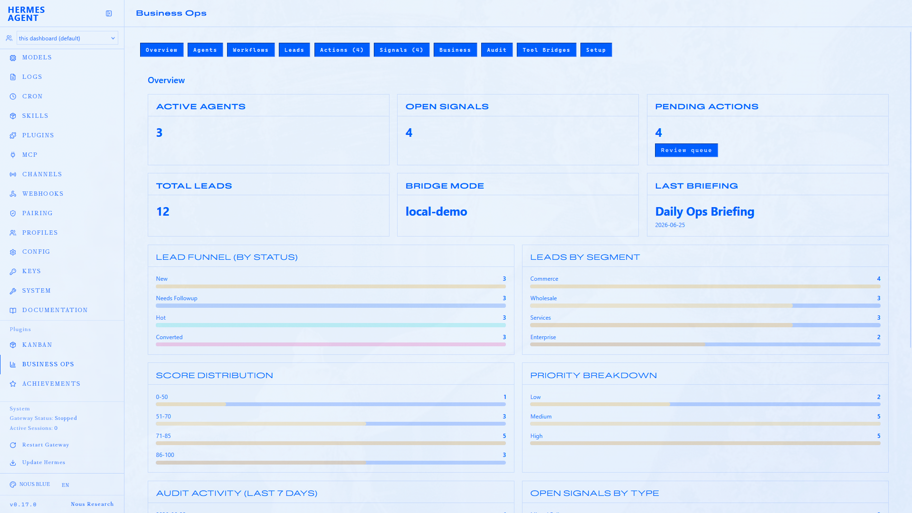
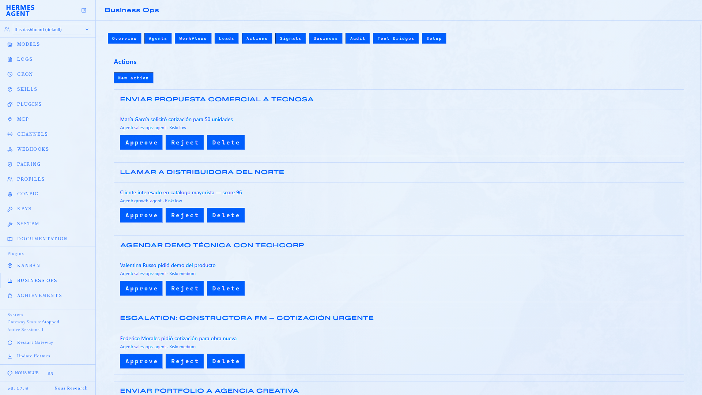

# HBO Plugin

<p align="center">
  
</p>

**Hermes Business Operations Plugin** — a Hermes-native extension for commerce and business operations.

Turn Hermes into a business operations workspace: capture signals from your tools, let agents propose actions, and approve with full audit trails.

HBO Plugin packages:

- a Hermes plugin with business ops tools and local demo state
- a **Business Ops** dashboard tab with internal pages
- three profile distributions (Sales Ops, Growth, Ops Lead)
- bundled workflow and bridge skills
- a Docusaurus docs and landing site

## Architecture


## Dashboard preview

The **Business Ops** tab in Hermes gives operators charts, lead management, workflow runs, and an approval queue — all backed by the same plugin state as Hermes chat.





More screenshots: [Dashboard docs](https://hbo-plugin-docs.vercel.app/docs/dashboard#screenshots)

## Quick start

### Install the full HBO system (recommended)

From a cloned repo:

```bash
./scripts/install-hbo.sh --with-demo
hermes dashboard --stop && hermes dashboard --no-open
./scripts/verify-hbo.sh
```

Windows:

```powershell
.\scripts\install-hbo.ps1 -WithDemo
hermes dashboard --stop; hermes dashboard --no-open
.\scripts\verify-hbo.ps1
```

This installs the plugin, creates the **bundled symlink** required for dashboard API routes, enables the plugin, and installs all three profile distributions.

> **Important:** Hermes 0.17+ blocks `plugin_api.py` for user plugins. The install script links the plugin into `hermes-agent/plugins/` so the Business Ops backend mounts correctly.

### Agent onboarding

After install, load skill `hbo-plugin:plugin-manager` for verify, restart, and troubleshooting. Then use `local-demo` and `demo-tour` for the product walkthrough.

### Demo prompt

Paste the [demo prompt](https://hbo-plugin-docs.vercel.app/docs/install#prompt) into Hermes to run the Business Ops Demo end-to-end.

## Troubleshooting

### Business Ops tab visible but no data (API 404)

Hermes does not mount the Python backend for user-sourced plugins. Run:

```bash
./scripts/install-hbo.sh
hermes dashboard --stop && hermes dashboard --no-open
```

Verify: `curl http://127.0.0.1:9119/api/plugins/hbo-plugin/health`

## Monorepo layout

```text
hbo-plugin/
  apps/docs/              # Docusaurus landing + documentation
  plugin/hbo-plugin/      # Hermes plugin + dashboard extension
  profiles/               # Agent profile distributions
  scripts/                # install-hbo, sync-plugin, verify
  examples/               # Sample data exports
  docs/                   # Contributor architecture docs
```

## Development

```bash
pnpm install
pnpm dev:docs          # Docusaurus dev server
pnpm dev:dashboard     # Dashboard extension (Vite)
pnpm build             # Build dashboard + docs
./scripts/sync-plugin.sh   # sync + bundled symlink to ~/.hermes/plugins/
```

## Documentation

- [Public docs](https://hbo-plugin-docs.vercel.app/) — install, demo, architecture (source: `apps/docs/`)

## License

MIT — see [LICENSE](LICENSE).
