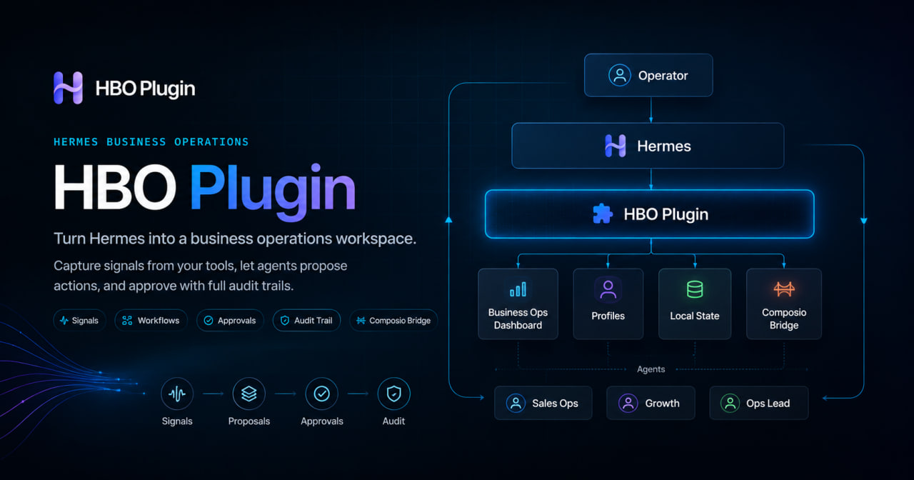
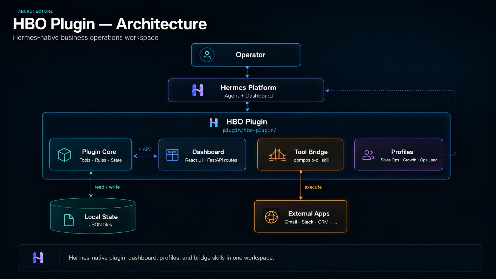

# HBO Plugin

<p align="center">
  
</p>

**Hermes Business Operations Plugin** — a Hermes-native extension for commerce and business operations.

Turn Hermes into a business operations workspace: capture signals from your tools, let agents propose actions, and approve with full audit trails.

HBO Plugin packages:

- a Hermes plugin with business ops tools and local demo state
- a **Business Ops** dashboard tab with internal pages
- three profile distributions (Sales Ops, Growth, Ops Lead)
- bundled workflow and bridge skills
- a Docusaurus docs and landing site

## Architecture



## Quick start

### Install the Hermes plugin

Copy or symlink into **user plugins** (required for dashboard API routes):

```bash
cp -r plugin/hbo-plugin ~/.hermes/plugins/hbo-plugin
hermes plugins enable hbo-plugin
```

> **Note:** Project-local `.hermes/plugins/` loads the UI but Hermes blocks `plugin_api.py` import for security. Use `~/.hermes/plugins/` for full functionality.

### Install profile distributions

```bash
hermes profile install ./profiles/sales-ops-agent --alias sales-ops
hermes profile install ./profiles/growth-agent --alias growth
hermes profile install ./profiles/ops-lead-agent --alias ops-lead
```

### Demo prompt

Paste the [demo prompt](https://hbo-plugin-docs.vercel.app/docs/install#prompt) into Hermes to run the Business Ops Demo end-to-end.

## Monorepo layout

```text
hbo-plugin/
  apps/docs/              # Docusaurus landing + documentation
  plugin/hbo-plugin/      # Hermes plugin + dashboard extension
  profiles/               # Agent profile distributions
  examples/               # Sample data exports
  docs/                   # Contributor architecture docs
```

## Development

```bash
pnpm install
pnpm dev:docs          # Docusaurus dev server
pnpm dev:dashboard     # Dashboard extension (Vite)
pnpm build             # Build dashboard + docs
```

## Documentation

- [Public docs](https://hbo-plugin-docs.vercel.app/) — install, demo, architecture (source: `apps/docs/`)
- [Demo script](https://hbo-plugin-docs.vercel.app/docs/demo-script) — canonical 3-minute demo path

## License

MIT — see [LICENSE](LICENSE).
