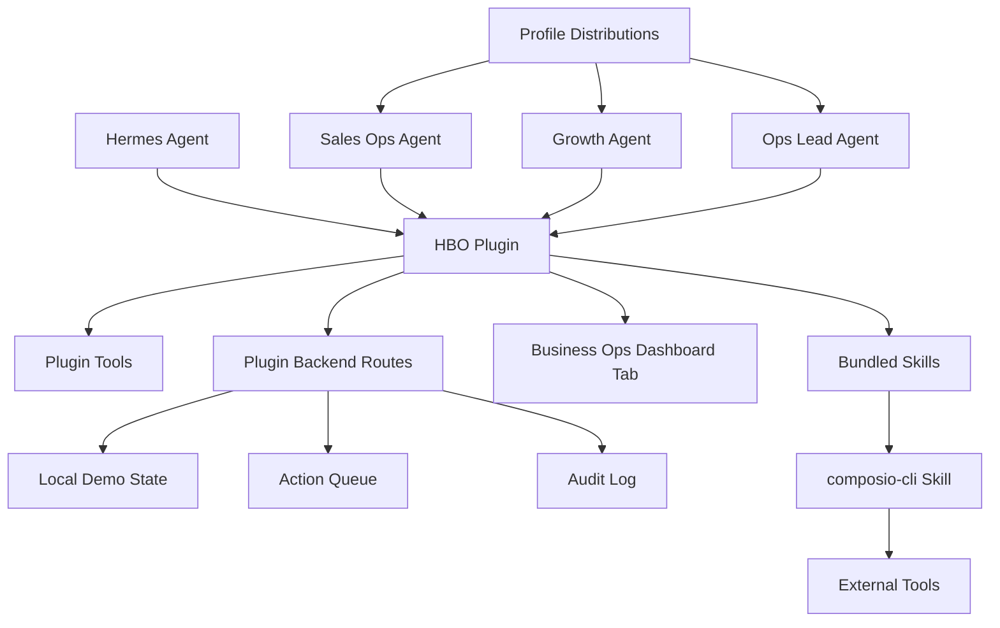

# Architecture

```mermaid
flowchart TD
  H[Hermes Agent] --> P[HBO Plugin]
  P --> T[Plugin Tools]
  P --> S[Bundled Skills]
  P --> D[Business Ops Dashboard Tab]
  P --> API[Plugin Backend Routes]
  API --> STATE[Local Demo State]
  API --> A[Action Queue]
  API --> AUDIT[Audit Log]

  PROF[Profile Distributions] --> SA[Sales Ops Agent]
  PROF --> GA[Growth Agent]
  PROF --> OA[Ops Lead Agent]

  SA --> P
  GA --> P
  OA --> P

  S --> CCLI[composio-cli Skill]
  CCLI --> EXT[External Tools]
```

See contributor docs in the repository `docs/` folder for detailed architecture notes.
