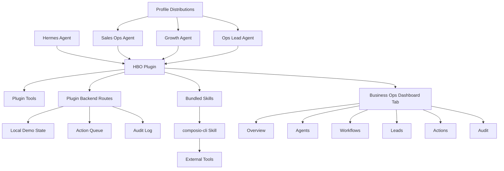

# HBO Plugin — Technical Specification

**Project name:** HBO Plugin  
**Full name:** Hermes Business Operations Plugin  
**Repository:** `hbo-plugin`  
**Document type:** Technical Specification  
**Status:** Draft v1  
**Primary platform:** Hermes Agent  
**Primary demo:** Business Ops Demo  
**Primary bridge for MVP:** `composio-cli` skill  
**Dashboard model:** One Hermes dashboard tab with internal pages  
**Docs:** Docusaurus required from MVP  
**Approval flow:** Real approve/reject actions in dashboard  

---

## 1. Technical Direction

HBO Plugin will be built from scratch as a Hermes-native project.

The project should not be a separate external SaaS-style application. The product should be packaged as:

```text
Hermes plugin
+ Hermes dashboard extension
+ Hermes profile distributions
+ bundled skills
+ local demo data
+ Docusaurus docs/landing site
```

The initial MVP should focus on a self-contained **Business Ops Demo** that works with local demo data first and can optionally connect to external tools through a single bridge skill:

```text
composio-cli
```

Other bridges such as WithOne / One CLI and n8n should be left out of MVP implementation. They can be mentioned later as future optional bridge skills, but should not be part of the initial build.

---

## 2. Confirmed Product Decisions

| Area | Decision |
|---|---|
| Repository name | `hbo-plugin` |
| Product name | HBO Plugin |
| Full name | Hermes Business Operations Plugin |
| Public demo name | Business Ops Demo |
| Dashboard model | One top-level `Business Ops` tab with internal pages |
| Initial data mode | Local demo data first |
| Recommended external bridge | Composio |
| MVP bridge skill | `composio-cli` only |
| Agent profiles | `Sales Ops Agent`, `Growth Agent`, `Ops Lead Agent` |
| Docs site | Required from MVP |
| Docs framework | Docusaurus |
| Architecture docs | Required; should include diagram source for future draw.io workflow |
| State persistence | Both local demo state and external-tool-backed state |
| Approvals | Real approve/reject controls |
| Demo video should show | Install, dashboard, profiles, workflow, and tool bridge |

---

## 3. Repository Structure

Recommended structure:

```text
hbo-plugin/
  apps/
    docs/
      # Docusaurus landing and documentation

  plugin/
    hbo-plugin/
      plugin.yaml
      __init__.py
      tools.py
      schemas.py
      state.py
      business_rules.py

      skills/
        sales-ops/
          SKILL.md
        growth-ops/
          SKILL.md
        ops-lead/
          SKILL.md
        composio-cli/
          SKILL.md
        local-demo/
          SKILL.md

      dashboard/
        manifest.json
        plugin_api.py
        src/
          index.tsx
          routes/
            Overview.tsx
            Agents.tsx
            Workflows.tsx
            Leads.tsx
            Actions.tsx
            Audit.tsx
            ToolBridges.tsx
            Setup.tsx
          components/
          api/
          styles/
        dist/
          index.js
          style.css

      data/
        business-ops-demo/
          workspace.json
          leads.json
          conversations.json
          actions.json
          audit.json
          briefings.json

  profiles/
    sales-ops-agent/
      distribution.yaml
      SOUL.md
      config.yaml
      skills/
      cron/
      README.md

    growth-agent/
      distribution.yaml
      SOUL.md
      config.yaml
      skills/
      cron/
      README.md

    ops-lead-agent/
      distribution.yaml
      SOUL.md
      config.yaml
      skills/
      cron/
      README.md

  examples/
    business-ops-demo/
      sample-leads.csv
      sample-conversations.json
      sample-actions.json
      README.md

  docs/
    PRODUCT_OVERVIEW_PRD.md
    TECHNICAL_SPEC.md
    PLUGIN_ARCHITECTURE.md
    DASHBOARD_EXTENSION.md
    PROFILE_DISTRIBUTIONS.md
    SKILLS.md
    COMPOSIO_CLI_BRIDGE.md
    DEMO_SCRIPT.md
    INSTALLATION_PROMPT.md

  AGENTS.md
  README.md
  LICENSE
```

---

## 4. Main Components

### 4.1 Hermes Plugin

The Hermes plugin is the core package.

Responsibilities:

```text
Register tools.
Expose local business ops state.
Serve dashboard backend routes.
Provide bundled skills.
Load demo data.
Manage action proposals.
Manage approval state.
Manage audit events.
Expose composio-cli setup and usage instructions.
```

Initial files:

```text
plugin.yaml
__init__.py
tools.py
schemas.py
state.py
business_rules.py
```

### 4.2 Dashboard Extension

The dashboard extension should create one top-level tab:

```text
Business Ops
```

Inside that tab, it should provide internal pages:

```text
Overview
Agents
Workflows
Leads
Actions
Audit
Tool Bridges
Setup
```

The dashboard should use local demo data by default and call plugin backend routes for state.

### 4.3 Profile Distributions

The project includes three Hermes profile distributions:

```text
Sales Ops Agent
Growth Agent
Ops Lead Agent
```

These are separate profiles, not just labels inside the UI.

Each distribution should include:

```text
distribution.yaml
SOUL.md
config.yaml
skills/
cron/
README.md
```

### 4.4 Docusaurus Site

The docs site is part of the MVP.

It should include:

```text
Landing page
Install guide
Demo prompt
Plugin overview
Profiles guide
Skills guide
Dashboard guide
Composio CLI bridge guide
Architecture guide
Demo script
```

### 4.5 Local Demo Data

Local demo data should ship with the plugin and make the demo work without external credentials.

The user should be able to install the plugin, load demo data, open the dashboard, and run the workflow.

### 4.6 Composio CLI Skill

The MVP should include one external tool bridge skill:

```text
composio-cli
```

The skill should explain:

```text
what Composio is
how to install the CLI
how to authenticate
how to verify access
how to search tools
how to run a test command
how HBO Plugin expects results to be normalized
how to troubleshoot common issues
```

The MVP should not require Composio to run the local demo.

Composio should enhance the demo by showing a real bridge path.

---

## 5. Plugin Tools

The plugin should register a minimal set of tools for Hermes.

Recommended initial tools:

```text
hbo_get_workspace
hbo_list_agents
hbo_list_workflows
hbo_run_workflow
hbo_list_leads
hbo_detect_signals
hbo_list_actions
hbo_approve_action
hbo_reject_action
hbo_generate_briefing
hbo_list_audit_events
hbo_load_demo_data
```

### 5.1 hbo_get_workspace

Purpose:

```text
Return current Business Ops workspace summary.
```

Output:

```json
{
  "workspaceName": "Business Ops Demo",
  "status": "ready",
  "activeAgents": 3,
  "openSignals": 7,
  "pendingActions": 5,
  "lastBriefingAt": "2026-06-25T10:00:00Z"
}
```

### 5.2 hbo_list_agents

Purpose:

```text
Return the configured agent profiles and recent activity.
```

Agents:

```text
Sales Ops Agent
Growth Agent
Ops Lead Agent
```

### 5.3 hbo_run_workflow

Purpose:

```text
Run one of the demo workflows.
```

Supported workflows:

```text
inbound_sales
outbound_growth
daily_ops_briefing
```

### 5.4 hbo_list_actions

Purpose:

```text
Return action proposals.
```

Action statuses:

```text
pending
approved
rejected
executed
failed
```

### 5.5 hbo_approve_action

Purpose:

```text
Approve a pending action.
```

This should mutate local state.

### 5.6 hbo_reject_action

Purpose:

```text
Reject a pending action.
```

This should mutate local state.

### 5.7 hbo_generate_briefing

Purpose:

```text
Generate a daily business briefing using the demo state.
```

---

## 6. Dashboard Pages

### 6.1 Overview

Purpose:

```text
Show the whole Business Ops workspace in one screen.
```

Cards:

```text
Active agents
Open signals
Pending actions
Priority leads
Last briefing
Selected bridge
Demo data status
```

### 6.2 Agents

Purpose:

```text
Show the three specialized agent profiles and their current work.
```

Cards:

```text
Sales Ops Agent
Growth Agent
Ops Lead Agent
```

Each card should show:

```text
role
active workflows
recent signals
proposed actions
next recommended command
```

### 6.3 Workflows

Purpose:

```text
Show the three workflows and allow demo runs.
```

Workflows:

```text
Inbound Sales
Outbound Growth
Daily Ops Briefing
```

Each workflow should show:

```text
owner agent
purpose
last run
status
generated outputs
run button
```

### 6.4 Leads

Purpose:

```text
Show demo leads and prospects.
```

Columns:

```text
Name
Source
Segment
Score
Priority
Status
Owner Agent
Recommended Action
```

### 6.5 Actions

Purpose:

```text
Show proposed actions and allow real approve/reject.
```

Controls:

```text
Approve
Reject
View details
```

When approved or rejected, state must update and an audit event must be created.

### 6.6 Audit

Purpose:

```text
Show traceability of agent activity and human decisions.
```

Columns:

```text
Timestamp
Agent
Event type
Summary
Source
Action
Decision
Result
```

### 6.7 Tool Bridges

Purpose:

```text
Show available tool bridge options, with composio-cli as MVP.
```

MVP content:

```text
Local demo data: active
Composio CLI: available
WithOne / One CLI: future
n8n: future
```

### 6.8 Setup

Purpose:

```text
Guide the user through installation and demo steps.
```

Should include:

```text
installation checklist
demo prompt
profile install status
plugin status
demo data status
next recommended step
```

---

## 7. Local State Model

The MVP can use file-backed JSON state.

This keeps the plugin simple and demo-friendly.

Recommended state files:

```text
plugin/hbo-plugin/data/business-ops-demo/workspace.json
plugin/hbo-plugin/data/business-ops-demo/leads.json
plugin/hbo-plugin/data/business-ops-demo/conversations.json
plugin/hbo-plugin/data/business-ops-demo/actions.json
plugin/hbo-plugin/data/business-ops-demo/audit.json
plugin/hbo-plugin/data/business-ops-demo/briefings.json
```

### 7.1 Workspace

```json
{
  "id": "business-ops-demo",
  "name": "Business Ops Demo",
  "status": "ready",
  "selectedBridge": "local-demo",
  "createdAt": "2026-06-25T00:00:00Z"
}
```

### 7.2 Agent

```json
{
  "id": "sales-ops-agent",
  "name": "Sales Ops Agent",
  "role": "sales_ops",
  "description": "Handles inbound sales operations and bot QA.",
  "status": "active"
}
```

### 7.3 Lead

```json
{
  "id": "lead_001",
  "name": "Demo Lead 001",
  "source": "demo_sheet",
  "segment": "commerce",
  "score": 82,
  "priority": "high",
  "status": "needs_followup",
  "ownerAgentId": "sales-ops-agent"
}
```

### 7.4 ActionProposal

```json
{
  "id": "act_001",
  "title": "Create follow-up task",
  "agentId": "sales-ops-agent",
  "source": "lead_001",
  "risk": "low",
  "status": "pending",
  "description": "Lead has high buying intent and no recent follow-up."
}
```

### 7.5 AuditEvent

```json
{
  "id": "audit_001",
  "timestamp": "2026-06-25T12:00:00Z",
  "agentId": "ops-lead-agent",
  "eventType": "action_approved",
  "summary": "User approved follow-up action act_001."
}
```

---

## 8. Approval Flow

Approvals must be real in the MVP.

Flow:

```text
Agent/workflow creates action proposal.
Dashboard shows action as pending.
User clicks Approve or Reject.
Plugin backend updates action status.
Plugin backend creates audit event.
Dashboard updates immediately.
```

Statuses:

```text
pending
approved
rejected
executed
failed
```

For MVP, execution can be simulated locally or connected to `composio-cli` later.

Approve/reject must not be purely visual.

---

## 9. Demo Workflows

### 9.1 Inbound Sales

Owner:

```text
Sales Ops Agent
```

Purpose:

```text
Review customer conversations and detect follow-up opportunities.
```

Demo output:

```text
Signals
Action proposals
Bot QA flags
Follow-up recommendations
```

### 9.2 Outbound Growth

Owner:

```text
Growth Agent
```

Purpose:

```text
Score prospects and prepare outreach actions.
```

Demo output:

```text
Lead scores
Priority segments
Outreach batch proposal
Follow-up tasks
```

### 9.3 Daily Ops Briefing

Owner:

```text
Ops Lead Agent
```

Purpose:

```text
Summarize all current business operations into a daily priority brief.
```

Demo output:

```text
Top priorities
Pending approvals
Risks
Recommended next actions
```

---

## 10. Profile Distribution Requirements

### 10.1 Sales Ops Agent

Files:

```text
profiles/sales-ops-agent/distribution.yaml
profiles/sales-ops-agent/SOUL.md
profiles/sales-ops-agent/config.yaml
profiles/sales-ops-agent/skills/
profiles/sales-ops-agent/cron/
profiles/sales-ops-agent/README.md
```

Profile focus:

```text
Inbound sales
Customer questions
Bot QA
Follow-up gaps
```

### 10.2 Growth Agent

Profile focus:

```text
Outbound lead generation
Lead scoring
Prospect segmentation
Outreach planning
```

### 10.3 Ops Lead Agent

Profile focus:

```text
Daily briefing
Prioritization
Approvals
Cross-agent coordination
```

---

## 11. Skills

### 11.1 Plugin Skills

Initial bundled skills:

```text
sales-ops
growth-ops
ops-lead
local-demo
composio-cli
```

### 11.2 composio-cli Skill

This skill is the only required external bridge skill for MVP.

It should include:

```text
install instructions
login instructions
account setup guidance
tool search examples
tool execution examples
how to verify connection
how to connect Google Sheets or another demo-friendly app
how to fallback to local demo mode
```

### 11.3 local-demo Skill

This skill should explain how to run the demo without external credentials.

It should include:

```text
load demo data
run workflows
approve/reject actions
generate briefing
open dashboard
```

---

## 12. Docusaurus Site

Docusaurus is required.

### 12.1 Required Pages

```text
Home
Install
Demo Prompt
Architecture
Plugin
Dashboard
Profiles
Skills
Composio CLI
Business Ops Demo
Development
```

### 12.2 Home Page

Home should answer quickly:

```text
What is HBO Plugin?
What does it add to Hermes?
What does the demo show?
How do I install it?
```

### 12.3 Demo Prompt Page

This should provide a copy-paste prompt for Hermes.

Example:

```text
Install HBO Plugin from the hbo-plugin repository.

Please:
1. read the README and docs,
2. install the Hermes plugin,
3. install the Sales Ops, Growth, and Ops Lead profile distributions,
4. load the Business Ops Demo data,
5. open the Hermes dashboard,
6. verify the Business Ops tab,
7. run the daily briefing workflow,
8. show the action queue,
9. approve one action,
10. explain how to enable the composio-cli skill.
```

### 12.4 Architecture Page

This should include:

```text
high-level architecture
plugin architecture
dashboard architecture
profile distribution architecture
state flow
tool bridge flow
```

The architecture source should be kept in a format that can later be recreated or maintained using draw.io.

For MVP, a Mermaid diagram is acceptable in docs. Later, add a `.drawio` source.

---

## 13. Architecture Diagram Draft

Initial architecture diagram:



---

## 14. Hackathon Demo Requirements

The demo should show:

```text
installation
dashboard
profiles
workflow
tool bridge
approval
audit
```

Recommended demo flow:

```text
1. Show landing/docs page.
2. Copy the install prompt.
3. Show Hermes installing or verifying the plugin.
4. Open Hermes dashboard.
5. Show Business Ops tab.
6. Show three agent profiles.
7. Run Daily Ops Briefing workflow.
8. Show pending actions.
9. Approve one action.
10. Show audit event.
11. Show composio-cli bridge skill as the path to real tools.
```

---

## 15. MVP Build Phases

### Phase 1 — Repository + Docs Skeleton

Deliverables:

```text
repo structure
README
AGENTS.md
Docusaurus app
initial PRD and technical spec
demo prompt page
```

### Phase 2 — Plugin Skeleton

Deliverables:

```text
plugin.yaml
__init__.py
tools.py
schemas.py
local demo data
basic plugin tools
```

### Phase 3 — Dashboard Extension

Deliverables:

```text
dashboard manifest
Business Ops tab
Overview page
Agents page
Actions page
plugin API routes
```

### Phase 4 — Profiles + Skills

Deliverables:

```text
Sales Ops Agent distribution
Growth Agent distribution
Ops Lead Agent distribution
local-demo skill
composio-cli skill
workflow skills
```

### Phase 5 — Workflows + Approval + Audit

Deliverables:

```text
inbound sales workflow
outbound growth workflow
daily briefing workflow
action queue
approve/reject
audit events
```

### Phase 6 — Demo Polish

Deliverables:

```text
demo script
screenshots
docs polish
architecture diagram
demo data cleanup
video-ready flow
```

---

## 16. Non-Goals

Do not build in MVP:

```text
standalone external app
separate backend service
real CRM replacement
real private customer data
WithOne bridge
n8n bridge
multi-tenant SaaS
billing
mass outreach sending
complex permissions
production integration runtime
```

---

## 17. Open Technical Questions

The next implementation pass should confirm:

1. Exact Hermes plugin manifest fields.
2. Exact dashboard extension build process.
3. Whether dashboard internal routing should be hash-based, state-based, or embedded-router-based.
4. Whether plugin local state should write inside plugin data folder or Hermes user data folder.
5. Exact profile distribution install command format for local paths.
6. Exact composio-cli commands to include in the skill.
7. Whether action execution should be local-only in MVP or include one real composio-cli call.
8. Whether Docusaurus should live under `apps/docs` with npm/pnpm workspace.
9. Whether to include a `.drawio` architecture file in MVP.
10. Which license to use.

---

## 18. Final Recommendation

Build the MVP as:

```text
hbo-plugin
  = Hermes plugin
  + Business Ops dashboard tab
  + local demo data
  + three profile distributions
  + bundled workflow skills
  + composio-cli bridge skill
  + Docusaurus docs site
```

Keep the first demo self-contained.

Use local demo data to guarantee reliability.

Use `composio-cli` as the path to real integrations, not as a hard dependency for the first run.
